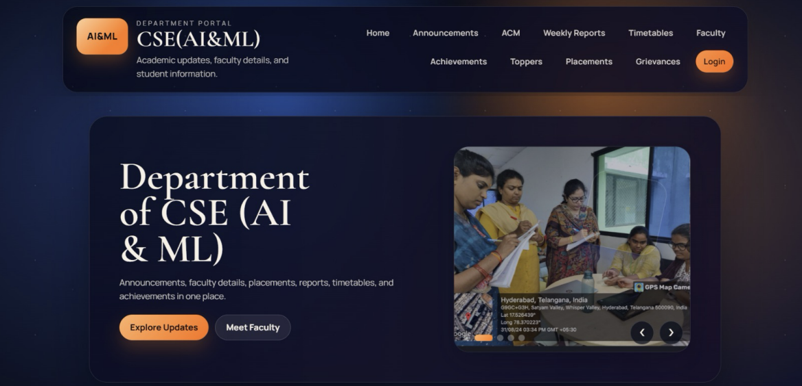
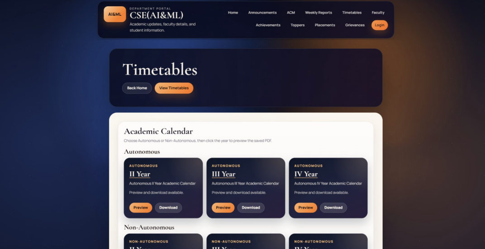
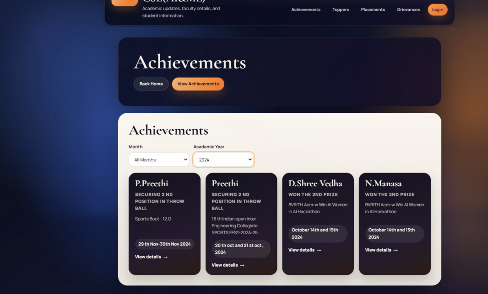

# Web-Based Department Information Management System

[]()
[]()
[]()
[]()

A full-stack web portal for the CSE (AI & ML) department at BVRIT Hyderabad College of Engineering for Women. It centralizes departmental data — placements, timetables, announcements, achievements, semester toppers, weekly reports, and grievances — into a single platform with role-based access control.

## Table of Contents

- [Features](#features)
- [Tech Stack](#tech-stack)
- [Project Structure](#project-structure)
- [Screenshots/Demo](#screenshots/demo)
- [Getting Started](#getting-started)
  - [Prerequisites](#prerequisites)
  - [Backend Setup](#backend-setup)
  - [Frontend Setup](#frontend-setup)
- [API Examples](#api-examples)
- [Roles & Access](#roles--access)
- [Contributors](#contributors)
- [License](#license)

## Features

- **Placements** — View placement stats, company-wise selections, and student placement details with a Placement Pulse Board
- **Announcements** — Real-time notices and department updates with priority tagging
- **Achievements** — Student and faculty achievements filterable by month and academic year
- **Semester Toppers** — Topper records filterable by year and semester
- **Weekly Reports** — CRC activity reports published by faculty in-charge
- **Timetables & Academic Calendar** — PDF upload and preview for autonomous and non-autonomous schedules
- **ACM Chapter** — Dedicated page for the ACM-W student chapter
- **Faculty Details** — Department faculty profiles with photos and designations
- **Grievances** — Anonymous complaint submission with category selection
- **Admin Dashboard** — Centralized control center to manage all modules (announcements, achievements, timetables, weekly reports, complaints)
- **Role-Based Access** — Firebase Authentication for Admin, CRC Member, and Faculty roles

## Tech Stack

| Layer          | Technology                   |
| -------------- | ----------------------------- |
| Frontend       | HTML, CSS, JavaScript         |
| Backend        | Java, Spring Boot             |
| Database       | MongoDB                       |
| File Storage   | MongoDB GridFS (PDF uploads)  |
| Authentication | Firebase Authentication       |
| Build Tool     | Maven                         |

## Project structure
```
├── frontend/
│   ├── pages/
│   ├── assets/
│   │   ├── css/
│   │   ├── js/
│   │   └── images/
│   └── components/
└── backend/
    └── src/main/java/com/department/dms/
        ├── controller/
        ├── service/
        ├── model/
        ├── repository/
        └── config/
```

## Screenshots/Demo




## Getting Started

### Prerequisites

- Java 21+
- Maven
- MongoDB (running locally or via Atlas)
- A Firebase project with Authentication enabled
- (Optional) VS Code with the Live Server extension, for previewing the frontend

### Backend Setup

1. Clone the repository:
   ```bash
   git clone https://github.com/Shanmukhi-Mudundi/Web-Based-Department-Information-Management-System.git
   cd Web-Based-Department-Information-Management-System/backend
   ```

2. Update `src/main/resources/application.properties`:
   ```properties
   spring.data.mongodb.uri=mongodb://localhost:27017/departmentDB
   spring.data.mongodb.database=departmentDB
   server.port=8081
   app.admin-token=YOUR_SECRET_TOKEN
   ```

3. Run the backend:
   ```bash
   ./mvnw spring-boot:run
   ```
   The API will be available at `http://localhost:8081`.

### Frontend Setup

1. Open `frontend/assets/js/firebase-init.js` and replace the Firebase config with your own project credentials from the Firebase Console.
2. Open `frontend/pages/index.html` in a browser, or serve the `frontend` folder via Live Server for correct handling of relative requests.
3. Make sure the backend is running on `http://localhost:8081`, or update the `API_BASE` variable in the relevant JS files to match your backend's address.

## API Examples

Get all announcements:
```bash
curl http://localhost:8081/api/announcements
```

Submit an anonymous complaint:
```bash
curl -X POST http://localhost:8081/api/complaints \
  -H "Content-Type: application/json" \
  -d '{"category":"infrastructure","message":"Projector not working in lab 2"}'
```

## Roles & Access

| Role           | Access                                                |
| -------------- | ------------------------------------------------------ |
| **Admin**      | Full access — manage all modules via Admin Dashboard   |
| **CRC Member** | Post weekly reports and student achievements           |
| **Faculty**    | Post announcements and faculty achievements             |
| **Student**    | View all public pages, submit anonymous complaints      |

## Contributors

| Name                | Roll No    |
| -------------------- | ---------- |
| Mudundi Shanmukhi    | 23WH1A6630 |
| D. Shree Vedha       | 24WH5A6601 |
| M. Vaishnavi Prasad  | 23WH1A6614 |
| D. Manasa            | 23WH1A6611 |

**Guide:** Ms. Asha Vuyyuru, Assistant Professor, CSE (AI & ML)
BVRIT Hyderabad College of Engineering for Women

## License

This project was developed as an Industry-Oriented Mini Project for academic purposes at BVRIT Hyderabad, 2025–2026.
